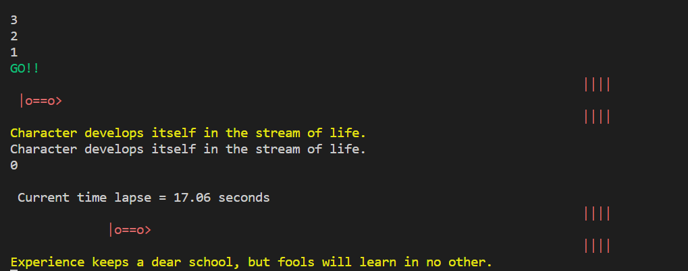
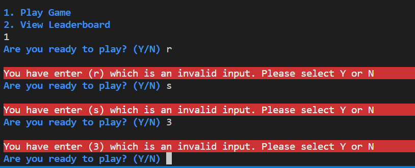

# Car Racer

Car Race is a simple Python terminal game, which testes the players typing skills and accuracy.
The game mimic the WPM(Words per minute) test which people will take. With the same principals and added a little game twist to it.

Link to the game can be found by [clicking here](https://carracerpython.herokuapp.com)


## Flow-chart

A flow chart was made using a web based flow chart application called [Lucidcharts](https://www.lucidchart.com)

This helped to mapped out the games logic and provided a solution diagram for the game.
Due to licensing restriction, we only display the game's logic at a very high-level.


## Instruction

- The Game loads and asks the player to enter their name.
- Once they have provided a valid name, they are presented with the game instruction on how the game works.
- Once the instructions has loaded they are then presented with 2 options. 1. Play the Game or 2. View Leaderboard
- Option 1 will ask the player if they want to start the game. Providing them with Y/N options
- Option 2 will display the top 10 players scores on the screen
- If the player selected option 1 and Y to start the game. They will be presented with a random text, which they
  to type out as quickly has possible.
- A failed match will result in a new random text to be displayed. The Player only get 3 chances before the game ends.
- If the player can successfully type out the random text as is 5 times, their final score will be added to the leaderboard.
- The player can choose to start a new game or leave the game.

## Features

The game has number of extra modules which has been added to provide the functionality required.
- Panads - Dataframe to present the leaderboard in a table format
- Numpy -  To change the default index number from 0 to 1 
- TermColor -  Changing the text in the game
- pyfiglet - Displaying the Car Racer Banner, by converting normal text to art text.
- time - To calculate the player's time
- os - to clear the clear
- request -  to send http request to the API and get the responses
- Google modules  - gspread and Google Authenticate was installed to authenicate, patch and get data from or Google sheet file.
- sys - To provide the typing effect with in the game.

### Start of the game

- The game starts by asking them for the name.


- Once they have provided their name, they are greet and instruction on how to play is displayed.
  They are also provided with 2 options.


- Option 1 will take them to the next step where they need to confirm if they want to start the game.


### Leaderboard

- If the player selects Option 2 , to View Leaderboard. The game will get the top 10 players from Google Sheets and present them to the player.


### Successful entries

- If the player can successfully match the text provided on the screen, then will be present with their current time and a new set on text to type.




- If the player successfully passes all 5 rounds they are presented with the Checked flag and their score uploaded to the Google Sheet


### Failed entry

- If the Player fails to type out the text exactly as display they will be present with a error and new line to type.


- If the player fails 3 times the game will end and then restart from the beginning.


### Generating a random word

- The sentences are obtained by an API endpoint which is queried in the code and then presented to the player.
  https://api.quotable.io/random is the endpoint we query and the content extracted from the response which is then
  displayed in the game.


### Features I would like to implement in the future

- Text overlay where the text presented and the text enter by the player is colored either Green or Red depends if the character match
  (Example site: https://itsfoss.com/ttyper/)
- More animation on the car movement(https://github.com/UpGado/ascii_racer)
- Add design to the HTML page


## Error Handling

### Entering Name

Player's are unable to enter a Name which is less than 3 character or is blank


### Invalid Selection on Option

Player's have to enter '1' or '2' to progress to the next screen


### Invalid Selection to Start Game

Player's have to enter 'Y' or 'N' to progress to the next screen



### Invalid Selection to End Game

Player's have to enter 'Y' or 'N' to progress to the exit the game


## Testing

### Manual test

Testing was done manually where I tried to enter invalid characters or options which were not there

- First I started with the Name input. Ensure my entered name was not blank and longer than 3 characters
- Once presented the next screen, tested that I was only able to enter a valid number (Option) to progress in the game
- Ensured that that the logic in the game was working correctly and not infinite loops were created
- Tested the retries section to ensure game ends
- Tested successful entries to confirm game ends and score is uploaded
- Confirmed that Leaderboard table is in the correct order.
- Tested Start,Game and Restart Game functions

### Python Code Validator Test

- PEP8 Online linter (Python validator)

Copied my final code into the input box and had the validator confirm there are no issues or warnings in my code.


### Bugs

At the moment now bugs were found in the finished code. However there were bugs found and fixed during the development of the game.
To name some of the bugs which were found and fixed are listed below

 - Infinite Loop in While Try
 - Successful entries counter not incrementing which resulted the game never ending
 - Leaderboard not sorting the scores correctly. Had to convert the scores to float before sorting
 - Moving the car to the finish line. Couldn't get the lines to stay in the correct position, so I removed the middle finish line

There were loads more found which resulted in the game logic and functionality to change. Some of the changes were down to time constraints.

## Deployment

The game was deployed to Heroku without any errors.
As it was only my second time deploying to Heroku, used the Code Institute Love Sandwiches walk through as a reminder. 

I ensure I added my creds.json to the .gitignore file is ensure the sensitive information is not pushed to Github

Was the code was ready and tested I run the ``` pip freeze > requirements.txt ```
Once completed I published everything to GitHub using the commands below

- ``` git add . ```
- ``` git commit -m "{My commit message}" ```
- ``` git push```

- Logged in to Heroku
- Created a new app
- Provided a name of the App and selected a Region of Europe
- Selected the Settings Tab
- Under Build Packs I added Python and NodeJS in that order
- Added my 2 config Vars, listed below
  + PORT, VALUE: 8000
  + CREDS, = Copied information in my creds.json file.
- Selected the Deploy Tab
- As my GitHub was already linked, I search for my repository for my project
- Once linked I clicked on Deploy Branch under the Manual Deployment section

## Technologies Used

* HTML
    * HTML was used to setup the core structure of the game. This was provided in the Code Institute Github Template  
* CSS
    * CSS stylesheet was used to style the website and gaming feature. This was provided in the Code Institute Github Template 
* JavaScript
    * Javascript helps with the terminal displaying the game. This was provided in the Code Institute Github Template 

* GitPod
    * A GitPod Workspace was used to code the website. Using Code Institute GitHub Template some other predefined technologies are installed to allow developers to integrate to Git for versioning and Python3
* GitHub
    * Github was used to store our committed Source Code and have a live website using GitHub Pages.
* Git 
    * Version control, integrated with GitPod
* Python
    * Python is the language used to create the game. The hosts all the functions and executes them when needed.

## Credits

Credits go to all the resources I found online to help build the games or to troubleshoot issues which I faced.
Logic of the game come from multiple resources and changed due to restriction, but is worth mention as it helped build the game.

- https://pypi.org/project/terminal-animation/
- https://pypi.org/project/termcolor/
- https://www.101computing.net/python-typing-text-effect/
- https://www.devdungeon.com/content/create-ascii-art-text-banners-python
- https://emojicombos.com/
- Multiple links to StackOverFlow https://stackoverflow.com/


### Special Thanks

Although the final is my own, I couldn't have gotten here without the vast resource available of Code Institute and of the Web.
To all the contribute on the World Wide Web, thank you.

The my mentor Daisy for helping me along the journey, insights and tips to get me over the finish line. 
